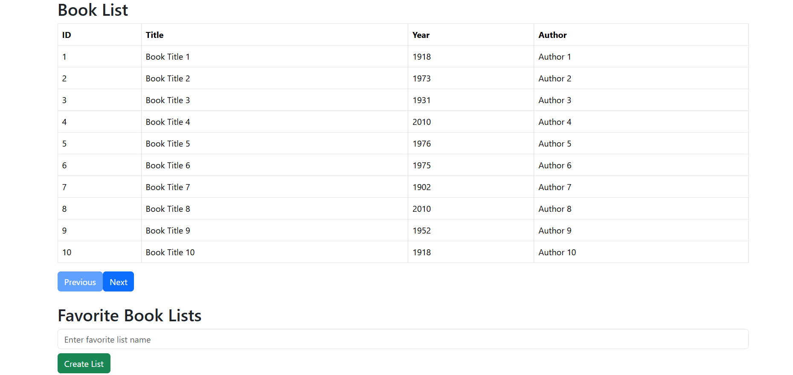
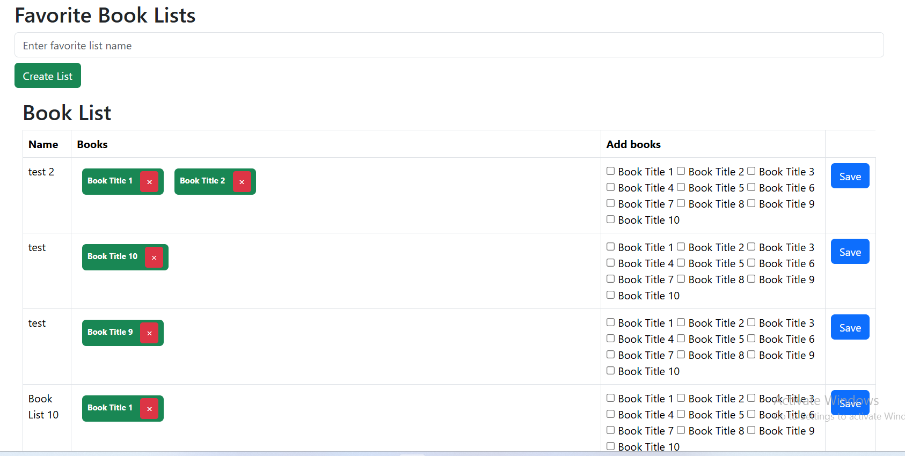

## Prerequisites

- Node.js (v16 or above)
- Angular CLI

## Installation

1. Clone the repository:
   ```bash
   git clone https://github.com/raheemiqram/book-management.git
   cd book-management

2. Install the required Node.js dependencies:
    ```bash
    npm install    


3. Start the Angular development server:
    ```bash
    ng serve


4. Features
    ```
    View all available books in a table format.
    Create and delete book lists.
    Add or remove books from a list.

5. Demo images

    
    